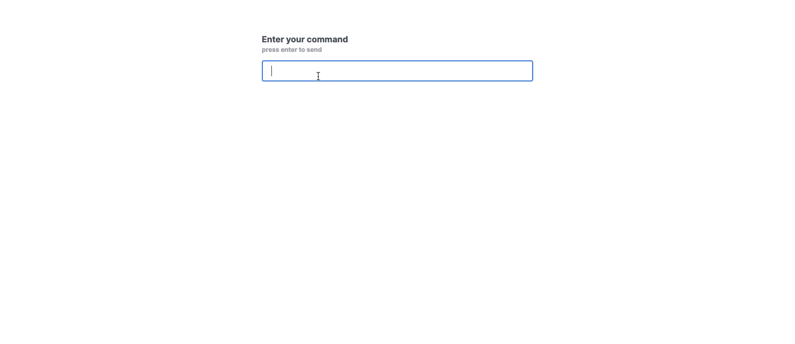

# Open AI Function Calling Sample

This is a sample project that demonstrates how to use Next.js to develop an Open AI function calling application.

## Screenshot



## Getting Started

1. Clone the repository:

   ```bash
   git clone https://github.com/goodjun/openai-function-calling-sample.git
   ```

2. Navigate to the project directory:

   ```bash
   cd openai-function-calling-sample
   ```

3. Install dependencies:

   ```bash
   npm install
   # or
   yarn install
   ```

4. Set up environment variables:

   - Create a `.env.local` file in the root of the project.
   - Add your Open AI API key to the `.env.local` file:

   ```
   TWELVEDATA_API_KEY=your twelvedata api key
   OPENAI_API_KEY=your open ai api key
   ```

5. Start the development server:

   ```bash
   npm run dev
   # or
   yarn dev
   ```

6. Open your browser and visit `http://localhost:3000` to see the application.

## Contributing

Contributions are welcome! If you find any issues or have suggestions for improvements, please create a new issue or submit a pull request.
